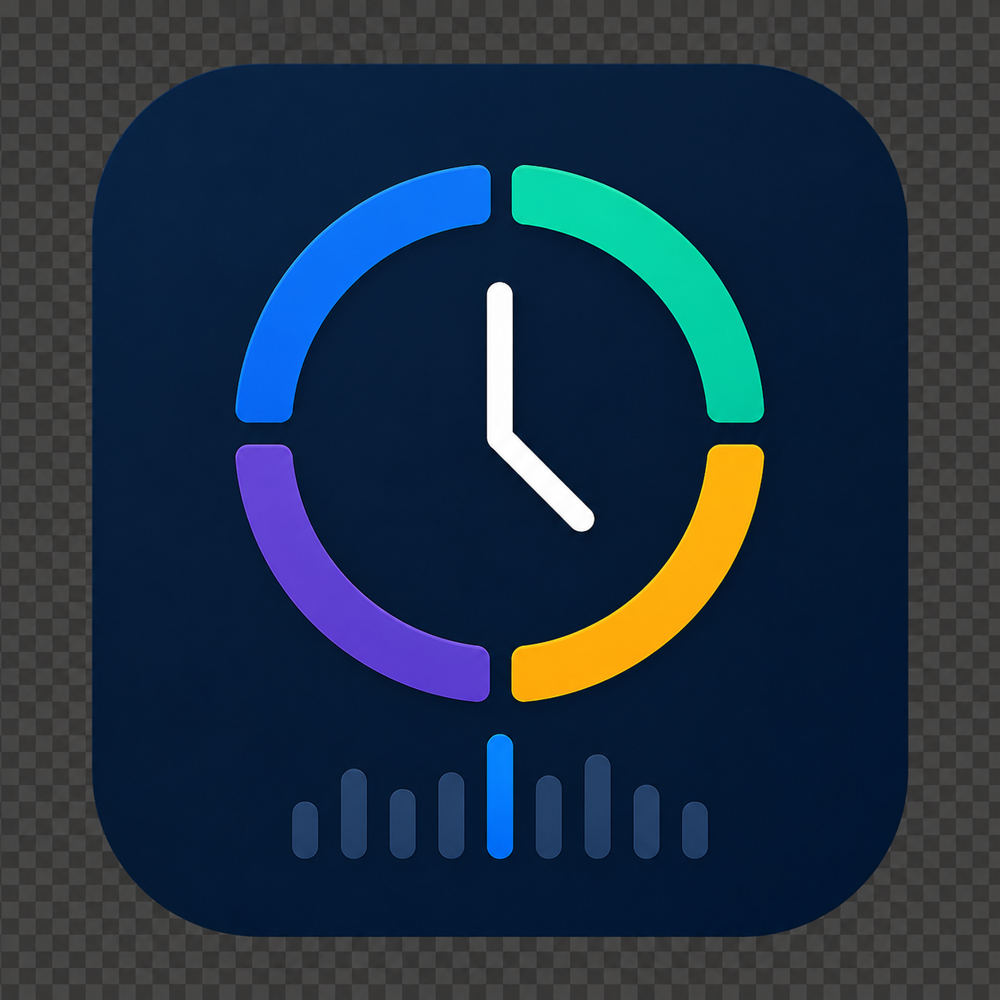
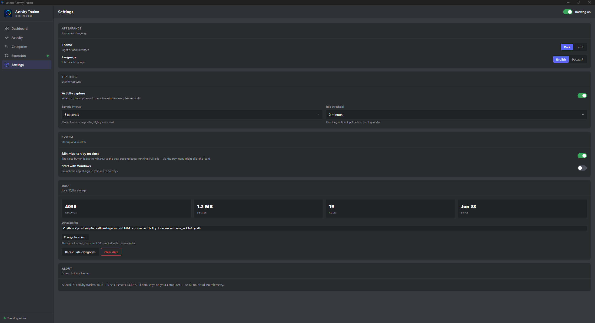

<div align="center">



# Screen Activity Tracker

Локальный трекер активности за ПК для Windows.
Отслеживает активное окно, определяет простой (idle) и категоризирует
приложения/домены. Всё хранится локально в SQLite — никаких облаков,
никакой телеметрии наружу.

[](https://github.com/Vell401/Screen_Activity_Tracker/releases/latest)
[](https://github.com/Vell401/Screen_Activity_Tracker/releases/latest)
[](https://github.com/Vell401/Screen_Activity_Tracker/releases/latest)
[](./LICENSE)

### [⬇️ Скачать для Windows](https://github.com/Vell401/Screen_Activity_Tracker/releases/latest)

Готовый установщик (`.exe`/`.msi`) — во вкладке **Releases** репозитория,
раздел «Assets» последнего релиза. Собирать самому не нужно.

</div>

## Превью

<p align="center">
  
</p>

<p align="center">
 
</p>
<!--
  Как добавить свои скриншоты:
  1. Сделайте PNG/JPG-скриншоты приложения.
  2. Положите их в docs/screenshots/ под именами выше (dashboard.png, activity.png)
     — или своими именами, тогда поправьте пути в img src.
  3. git add docs/screenshots && git commit && git push — GitHub рендерит
     изображения по относительному пути только из закоммиченных файлов.
-->

## Возможности
- 📊 Трекинг активного окна (приложение + заголовок) с настраиваемым интервалом
- 📈 Дашборд с KPI, таймлайном (часы/дни), топами приложений и доменов,
  распределением по категориям (графики — свои на SVG, без внешних библиотек)
- 🗂️ Журнал «Активность» с поиском и фильтрами
- 🧩 Браузерное расширение (Chrome/Edge/Brave/Opera/Yandex/Vivaldi) — точные URL
  и домены вкладок через локальный сервер `127.0.0.1` (без реестра и админа)
- ⏸️ Idle detection через `GetLastInputInfo`
- 🏷️ Категоризация по правилам (домен/процесс → категория) с CRUD-интерфейсом
- 🎨 Discord-подобный тёмный интерфейс с повышенным контрастом для данных
- 🔒 100% локально, без AI и облака

## Стек
Tauri v2 · Rust · React 18 · TypeScript · Vite · SQLite · Zustand

## Установка и запуск

> Это инструкция для сборки из исходников (для разработки). Если нужно
> просто пользоваться приложением — скачайте готовый установщик выше.

### Требования
- [Node.js](https://nodejs.org/) 18+
- [Rust](https://rustup.rs/) (stable)
- MSVC Build Tools (C++ + Windows SDK) — для сборки Rust под Windows

### Дев-режим
```bash
npm install
npm run tauri dev
```
Откроется окно приложения с hot reload фронтенда.

### Release-сборка
```bash
npm run tauri build
```
Готовый установщик появится в `src-tauri/target/release/bundle/`.

## Браузерное расширение
Чтобы трекер видел точные URL и домены вкладок:
1. Откройте в приложении вкладку **«Расширение»** → **«Создать папку»**
   (папка появится рядом с файлом БД — путь показан там же).
2. В браузере: страница расширений → «Режим разработчика» → «Загрузить
   распакованное расширение» → выберите эту папку.

Готово — индикатор станет зелёным. Реестр, права администратора и перезапуск
браузера **не нужны**: расширение шлёт данные на локальный сервер приложения
(`127.0.0.1`), в интернет ничего не уходит.

## Структура
- `src/` — React-фронтенд
  - `views/` — Dashboard, Activity, Categories, Extension, Settings
  - `components/` — Card, Sidebar, charts (SVG), ui, icons
  - `lib/` — обёртки IPC, форматтеры, хуки
- `src-tauri/` — Rust-бэкенд
  - `src/capture/` — capture engine (window, idle, browser)
  - `src/db/` — SQLite-слой, миграции, модели, категоризация
  - `src/{server,extension,bridge}.rs` — локальный сервер + браузерное расширение
  - `src/commands.rs` — Tauri IPC-команды
  - `src/lib.rs` — setup приложения
  - `resources/extension/` — исходники браузерного расширения (встраиваются)


## Лицензия
MIT
